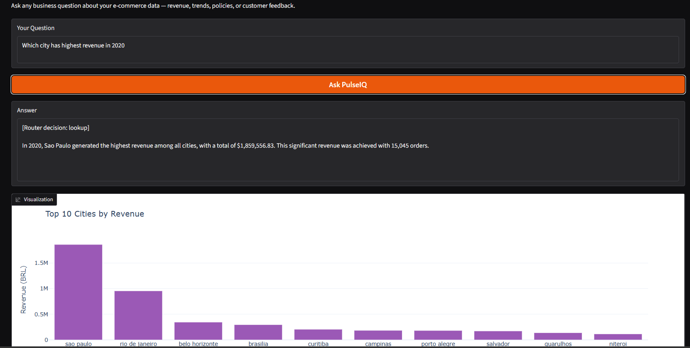
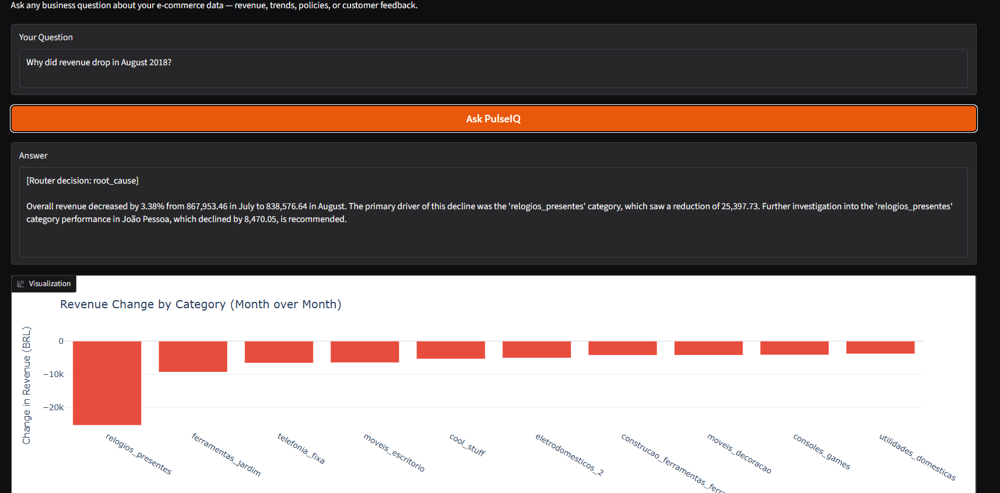
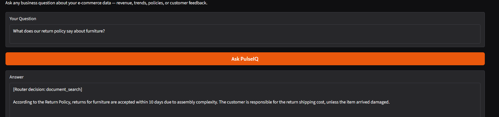

# PulseIQ: Agentic AI for Business Data Analysis

An AI-powered business intelligence copilot that answers natural language 
questions about e-commerce data using a multi-agent system — combining 
structured analytics, root-cause reasoning, and document retrieval (RAG) 
into one conversational interface.

**Live Demo:** _[link coming soon]_

---

## The Problem

Business analysts spend hours manually pulling numbers, comparing time 
periods, and digging through policy documents to answer simple questions 
like "why did revenue drop last month?" or "what does our return policy 
say about a specific category?" 

PulseIQ automates this — ask a question in plain English, get a grounded, 
verifiable answer backed by real calculations, not hallucinated numbers.

---

## How It Works
User Question

↓

[Router Agent] — classifies into 3 types using Gemini

↓

┌──────────────┬──────────────────┬─────────────────────┐

│              │                  │                      │

[Query Agent] [Insight Agent]  [RAG Agent]

Lookups,      Root-cause       Searches policy docs

comparisons   analysis         + customer reviews

(Pandas)      (Pandas +        (ChromaDB + embeddings)

Gemini)

│              │                  │

└──────────────┴──────────────────┘

↓

Gemini explains result in

plain English + Plotly chart

↓

Gradio Interface

**Core design principle:** Gemini never does arithmetic. Every number 
comes from Pandas, calculated from real data. Gemini's role is limited 
to classification, planning, and explaining results in natural language — 
this prevents hallucinated numbers in the final answer.

---

## Tech Stack

| Layer | Tool |
|---|---|
| LLM | Google Gemini 2.5 Flash-Lite |
| Agent Orchestration | Custom Router pattern (Plan → Execute → Explain) |
| Data Processing | Pandas, Medallion Architecture (Bronze/Silver/Gold) |
| RAG / Document Search | ChromaDB, Gemini Embeddings |
| Visualization | Plotly |
| Interface | Gradio |
| Data Source | Olist Brazilian E-Commerce Dataset (100K+ orders) |

---

## Key Features

- **3-way intelligent routing**: distinguishes lookup questions, root-cause 
  questions, and document/policy questions automatically
- **Grounded calculations**: all numbers verified via Pandas, cross-checked 
  across Silver and Gold layers during development
- **RAG over mixed sources**: searches both structured policy documents and 
  real (Portuguese-language) customer reviews using semantic search
- **Incremental data pipeline**: a "daily drip" simulator demonstrates how 
  the Gold layer recalculates as new data batches arrive, mimicking a 
  production ingestion pattern
- **Dynamic, data-driven charts**: visualizations are generated from the 
  same verified numbers in the text answer, never independently invented

---

## Example Questions

- "What was total revenue in 2017?"
- "Why did revenue drop in August 2018?"
- "How did revenue change from July to August 2018?"
- "What does our return policy say about furniture?"
- "What do customers say about delivery delays?"

---

## Screenshots

**Lookup Query**


**Root Cause Analysis**


**Document/Policy Search**


## Project Structure
agent_project/

├── data/                       # Raw + processed datasets (Bronze/Silver/Gold)

├── policy_docs/                 # Synthetic policy documents for RAG

├── chroma_db/                   # Local vector database

├── build_silver.py              # Bronze → Silver cleaning + joins

├── build_gold.py                # Silver → Gold aggregations

├── build_rag.py                 # Builds RAG vector database

├── query_agent.py               # Lookup + comparison agent

├── insigt_why_agent.py          # Root-cause analysis agent

├── rag_agent.py                 # Document/review search agent

├── router.py                    # Classifies + routes questions

├── chart_builder.py             # Plotly chart generation

├── gemini_helper.py             # Rate-limit-safe Gemini wrapper

├── run_daily_drip.py            # Incremental data pipeline simulator

├── app.py                       # Gradio interface

└── KNOWN_LIMITATIONS.md         # Documented scoping decisions
---

## Setup

```bash
# Clone the repo
git clone <your-repo-url>
cd agent_project

# Create virtual environment
python -m venv venv
venv\Scripts\activate   # Windows

# Install dependencies
pip install google-genai pandas plotly gradio python-dotenv chromadb

# Add your Gemini API key
echo "GEMINI_API_KEY=your_key_here" > .env

# Build the data pipeline
python build_silver.py
python build_gold.py
python build_rag.py

# Run the app
python app.py
```

---

## Known Limitations & Future Work

See [KNOWN_LIMITATIONS.md](./KNOWN_LIMITATIONS.md) for documented scoping 
decisions, including:
- Recommendation/strategy-style questions (e.g. "how can we improve X") 
  are not yet a distinct reasoning path
- Currently scoped to one dataset/domain by design, with a documented 
  path toward generalized dataset support

---

## Engineering Notes

This project surfaced several real debugging challenges, each documented 
and resolved during development:
- Diagnosed and fixed a free-tier API rate-limiting issue using Google's 
  usage dashboard, distinguishing per-minute bursts from daily quota limits
- Found and fixed a silent misclassification bug where comparison 
  questions ("July vs August") were being interpreted as single-year 
  filters, producing a result 25x too large
- Verified data accuracy independently across Bronze, Silver, and Gold 
  layers before trusting agent-reported numbers